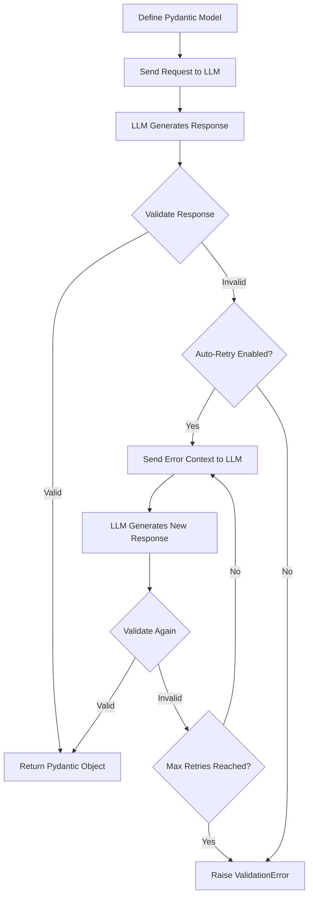

# Validation

Instructor uses Pydantic for validation, providing type checking, data coercion, custom validators, and field constraints.

## Validation Flow



## Basic Validation

Define models with type hints and field constraints:

```python
from typing import List
from pydantic import BaseModel, Field, field_validator


class User(BaseModel):
    name: str = Field(..., min_length=2, description="User's full name")
    age: int = Field(..., ge=0, le=150, description="User's age")
    emails: List[str] = Field(description="List of email addresses")

    @field_validator('emails')
    @classmethod
    def validate_emails(cls, v):
        if not all('@' in email for email in v):
            raise ValueError('Invalid email format')
        return v
```

## Field Validation

Use `Field()` for basic constraints:

```python
from pydantic import BaseModel, Field


class Product(BaseModel):
    name: str = Field(..., min_length=1, max_length=100)
    price: float = Field(..., gt=0)
    quantity: int = Field(..., ge=0)
```

## Custom Validators

Use `@field_validator` for complex validation:

```python
from pydantic import BaseModel, Field, field_validator


class Order(BaseModel):
    items: list[str] = Field(description="List of item names")
    total: float = Field(description="Total order amount")

    @field_validator('total')
    @classmethod
    def validate_total(cls, v):
        if v < 0:
            raise ValueError('Total cannot be negative')
        return v
```

## Pre-validation Transformation

Transform data before validation:

```python
from pydantic import BaseModel, field_validator


class UserProfile(BaseModel):
    username: str

    @field_validator('username', mode='before')
    @classmethod
    def lowercase_username(cls, v):
        return v.lower() if isinstance(v, str) else v
```

## Semantic Validation

Use `llm_validator` for validations that are hard to express programmatically:

```python
from typing import Annotated
from pydantic import BaseModel, BeforeValidator
import instructor
from instructor import llm_validator

client = instructor.from_provider("openai/gpt-4.1-mini")


class ContentReview(BaseModel):
    title: str
    content: Annotated[
        str,
        BeforeValidator(
            llm_validator(
                "Content must be family-friendly and not contain profanity",
                client=client,
            )
        ),
    ]
```

Semantic validation works well for content moderation, tone validation, consistency checks, and complex relationships. For more patterns and details, see the [Semantic Validation](./semantic_validation.md) guide.

## Nested Validation

Validate nested structures:

```python
from pydantic import BaseModel, Field


class Address(BaseModel):
    street: str
    city: str
    country: str


class User(BaseModel):
    name: str
    addresses: list[Address] = Field(description="User's addresses")
```

## Error Handling

Handle validation failures with appropriate error types:

```python
import instructor
from pydantic import BaseModel, Field, field_validator


class User(BaseModel):
    name: str
    age: int

    @field_validator('age')
    @classmethod
    def validate_age(cls, v):
        if v < 0:
            raise ValueError("Age cannot be negative")
        return v


client = instructor.from_provider("openai/gpt-4.1-mini")

try:
    user = client.create(
        response_model=User,
        messages=[
            {"role": "user", "content": "Extract: John, age: -5"},
        ],
    )
except instructor.exceptions.InstructorValidationError as e:
    print(f"Validation error: {e}")
```

## Best Practices

1. **Start simple**: Begin with basic type validation before adding complex rules
2. **Use type hints**: Always specify types for clarity
3. **Document constraints**: Add descriptions to Field() definitions
4. **Choose the right validation type**: Rule-based for objective criteria, semantic for subjective
5. **Handle errors**: Implement proper error handling for validation failures
6. **Consider costs**: Semantic validation with LLMs incurs API costs and latency

## See Also

- [Semantic Validation](./semantic_validation.md) - LLM-based validation patterns
- [Reask Validation](./reask_validation.md) - Automatic retry with validation feedback
- [Retrying](./retrying.md) - Configure retry behavior
- [Error Handling](./error_handling.md) - Handle validation failures
